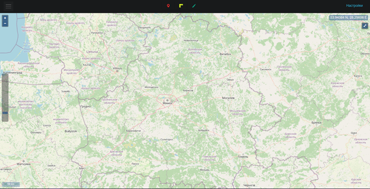
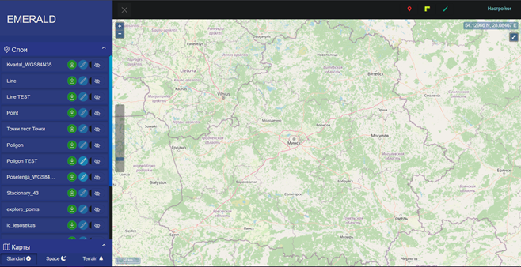
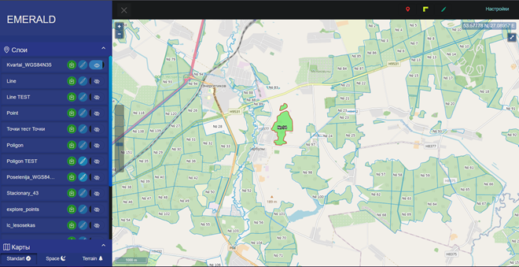
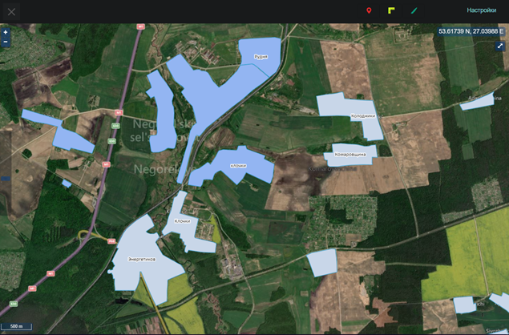
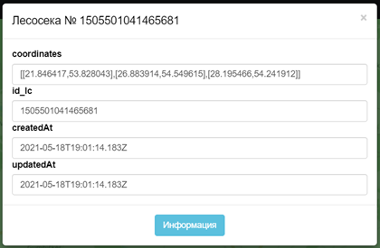
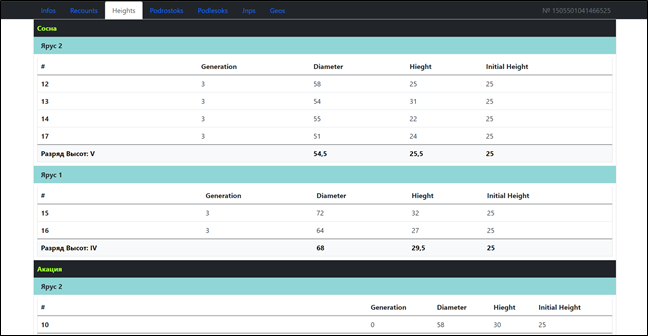

# Emerald
Geographic information system

Приложение позволяющее вести звукозапись в обычном и фоновом режиме, создавать расписания включения звукозаписи в фоновом режиме, так же поддерживает, резервное копирование в облачное хранилище,
Шифрование БД и активацию звукозаписи при помощи комбинации клавиш

Sing In

После авторизации приложения вы перейдёте на Главную страницу. В правом нижнем углу присутствует кнопка для начала записи, при нажатии на неё индикатор сверху будет соответствовать громкости звуков, которые он записывает

Перейдя на следующую вкладку, пользователь увидит следующую форму для установки Времени и периода записи в фоновом режиме

Работа с данной формой происходит следующим образом

